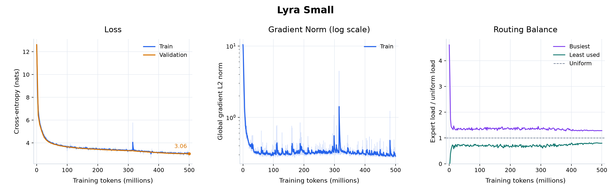
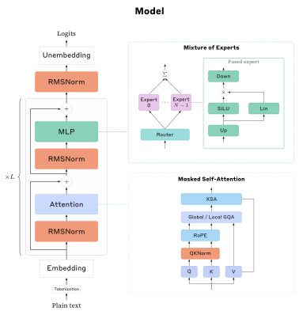
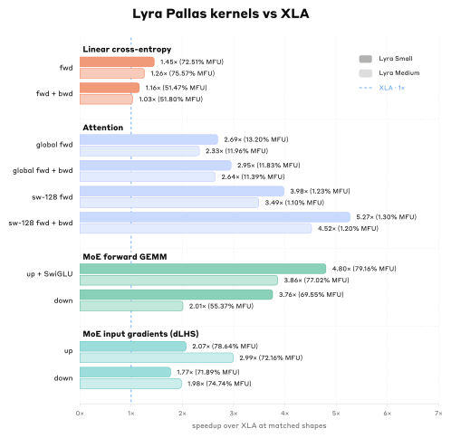

# Lyra

Lyra is an end-to-end LLM pretraining stack in pure JAX, built and optimized for TPUs. It covers everything from loading tokenized data to sampling from and evaluating a trained MoE model in a compact and efficient codebase.

## Quick Start

On a TPU machine, install with [uv](https://docs.astral.sh/uv/):

```bash
git clone https://github.com/ibbyml/lyra.git
cd lyra
uv sync --extra tpu

# Download the 21B-token training set and train Lyra Small
uv run data/dataset.py
uv run scripts/train.py

# Generate text and evaluate the saved checkpoint
uv run scripts/serve.py
uv run scripts/evals.py --weights chkpt/lyra-small --tasks mmlu arc-challenge hellaswag
```

The default run trains `lyra-small` on ~20B tokens, saving to `chkpt/lyra-small` every 1,000 updates and at completion.

For a small local example, follow the [20-step CPU example](dev/docs/usage.md#short-cpu-run). The [usage guide](dev/docs/usage.md) covers data, resuming, generation, evaluation, and GPT-OSS weights.

## Training

Training uses a hybrid Muon + Adam optimizer. Weights are stored in FP32 and compute runs in BF16. Data streams from ArrayRecord shards through Grain. Orbax checkpoints, saved locally or on GCS, include the optimizer and data-loader state along with the weights, so an interrupted run resumes where it stopped.

### Results

To check the full stack before the full pretraining run, Lyra Small was trained on 500M tokens on a single TPU v6e. That run's recipe is now shared by the pretraining presets. It took roughly ~4.5 hours and kept a sustained ~34,000 TPS, High MFU (+24%), and remained healthy for the duration of the run.



The [500M-token checkpoint](https://huggingface.co/Ibbyml/lyra-small-1.6B) is available on Hugging Face, with Orbax model weights and download instructions.

### Samples

> **Prompt**: The surprising thing about the ocean is
>
> **Completion**: that it is not always the case that the ocean is the only place where the ocean can support life. There are also some places where the ocean can be a source of food, a source of water, a source for life. [...]
>
> **Prompt**: The history of astronomy begins with
>
> **Completion**: Galileo Galilei. His work was published in 1619, and he was the first to use the word "astronomy" to refer to the study of celestial bodies in their natural environment. […]
>...

The [run notes](dev/runs/lyra-small-500m) have the full setup, metrics, and samples.

## Stack

### Model

Lyra Small is a 1.62B-parameter MoE transformer based on the GPT-OSS architecture.

<div align="center">
  <picture>
      
  </picture>
</div>

Attention is a Gated GQA and alternates between local and global windows (LGLG). It also has support for tanh XSA (on from Medium up), Learned Attention Sinks, and a quantized KV Cache.

| Model | Context | Width | Layers | Experts | Parameters | Active |
| --- | ---: | ---: | ---: | ---: | ---: | ---: |
| `lyra-small` | 4096 | 2048 | 16 | 15 + 1 shared | 1.6B | 1.0B |
| `lyra-medium` | 4096 | 4096 | 32 | 31 + 1 shared | 17.7B | 6.4B |
| `lyra-large` | 4096 | 4096 | 32 | 31 + 1 shared | 51.5B | 9.2B |
| `lyra-max` | 4096 | 4096 | 32 | 63 + 1 shared | 99.9B | 9.2B |

Lyra can also load OpenAI's original `gpt-oss-20b` and `gpt-oss-120b` checkpoints for generation and evaluation. 

The [design guide](dev/docs/design.md) covers the architecture, optimizer, and sharding in more depth.

### Kernels

<div align="center">
  <picture>
      
  </picture>
</div>

Lyra currently has optimized kernels for the following operations:

- [Flash attention](lyra/kernels/flash_attention.py) for global and sliding-window layers. Sliding-window layers visit only the tiles inside the window.
- [Fused linear cross-entropy](lyra/kernels/cross_entropy.py). Fuses the Output Head Linear + Cross Entropy.
- [Grouped expert matmuls](lyra/kernels/gemm.py) fuse SwiGLU into the up projection, and a [SparseCore combine](lyra/kernels/combine.py), adapted from MaxText, gathers the expert outputs.
- Decode [attention](lyra/kernels/decode_attention.py) and [matmul](lyra/kernels/decode_gemm.py) kernels handle generation, with BF16 or FP8 caches and weights.

Against XLA on one TPU v6e at Small's shapes (B=4, T=4096), from the [Benchmarks](dev/benchmarks/RESULTS.md#lyra-small-b4):

| Operation | Pallas ms | XLA ms | Speedup | Temp. mem saved |
| --- | ---: | ---: | ---: | ---: |
| Global attention, Forward | **2.269** | 6.112 | 2.69× | 99.95% |
| SW-attention, Forward | **1.501** | 5.970 | 3.98× | 99.95% |
| MoE up projection + SwiGLU | **1.513** | 7.258 | 4.80× | 100% |
| MoE down projection | **0.861** | 3.240 | 3.76× | 100% |
| Linear Cross-Entropy, Forward | **5.068** | 7.330 | 1.45× | 99.99% |
| Expert combine, forward | **1.058** | 3.021 | 2.86× | 99.96% |

The [kernel guide](dev/docs/kernels.md) covers each kernel, and the [benchmarks](dev/benchmarks/RESULTS.md) have the full measurements.

### Dataset

[Lyra ClimbMix 30B](https://huggingface.co/datasets/Ibbyml/lyra-climbmix-30b) contains 30B tokens of shuffled ClimbMix, pretokenized with `o200k_harmony` and stored in 100 ArrayRecord shards. The download script fetches 21B training tokens by default, plus a separate 300M-token validation shard, ready for Lyra's data loader.

## Acknowledgements

Lyra builds on ideas, tools, and writing from a number of people and projects:

- OpenAI's [GPT-OSS](https://github.com/openai/gpt-oss), whose architecture and design choices provided much of the foundation for this project.
- The Google DeepMind team and authors of [How to Scale Your Model](https://jax-ml.github.io/scaling-book/), which was an invaluable reference throughout development, particularly for distributed training and roofline analysis.
- Special thanks to Patrick Toulme for his [blog](https://patricktoulme.substack.com/). His posts on TPUs, Pallas, and XLA fundamentally improved my understanding of TPU programming and compiler output, and directly informed much of the Pallas kernel work in Lyra.
- The [JAX LLM](https://github.com/jax-ml/jax-llm-examples) and [Tokamax](https://github.com/openxla/tokamax) teams for excellent examples of practical, high-performance JAX development.
- Andrej Karpathy and [nanochat](https://github.com/karpathy/nanochat), which helped inspire the spirit and direction of this project.
- Keller Jordan for [Muon](https://kellerjordan.github.io/posts/muon/) and [Modded-NanoGPT](https://github.com/KellerJordan/modded-nanogpt), both of which influenced the training and optimization work here.
- NVIDIA and the CLIMB team for making the [ClimbMix dataset](https://research.nvidia.com/labs/lpr/climb/) available.

## Citation

If you find Lyra useful in your research, please cite:

```bibtex
@misc{Lyra,
  author = {Ibrahim Khan},
  title = {Lyra: A performant LLM pretraining stack in pure JAX.},
  year = {2026},
  publisher = {GitHub},
  url = {https://github.com/ibbyml/lyra}
}
```

## License

[MIT](LICENSE)
